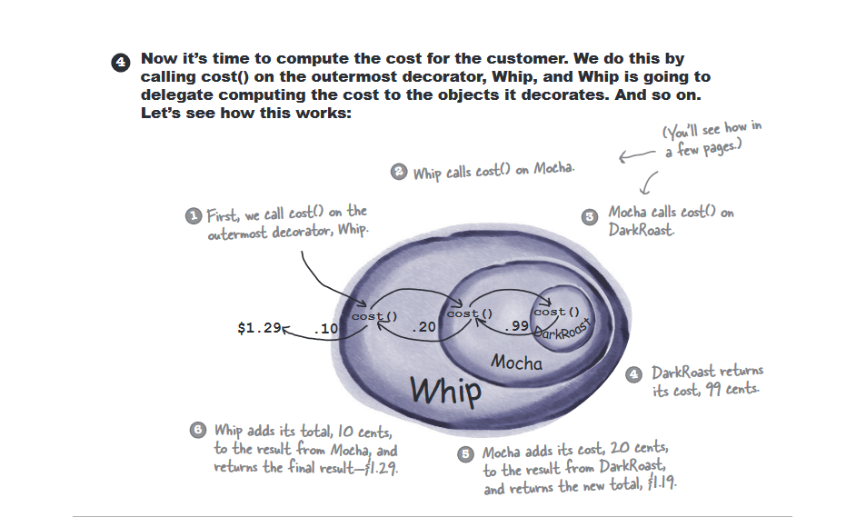
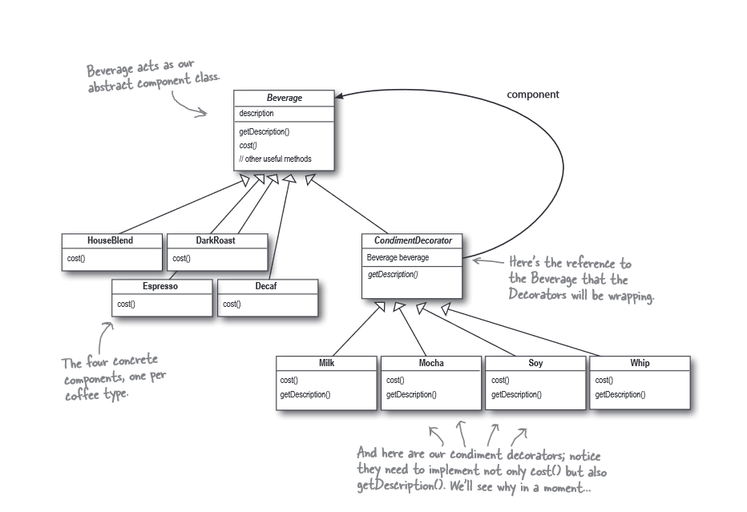

# Decorator pattern definition
```

The Decorator Pattern attaches additional responsibilities to an object dynamically. 
Decorators provide a flexible alternative to subclassing for extending functionality

```

This pattern is kind of about the below rule:
* Open Close Principle: Classes should be open for extension but closed for modification.

#### **Example description :**
In this example we can create different coffees with different condiments dynamically.
and at the end of the process we can get the total cost and total description.

#### What we know about the decorator
* Decorators have the same supertype as the objects they decorate
* We can use one or more decorators to wrap an object

#### The Decorator



###### The images are from Head first design pattern book.