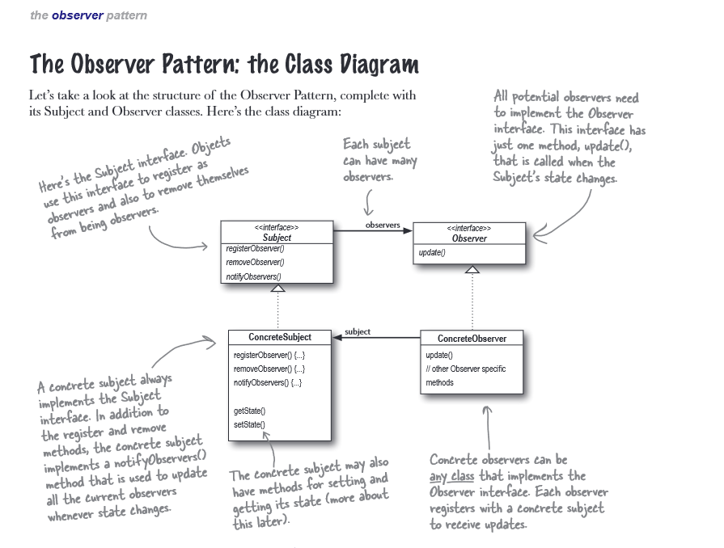

# Observer pattern definition
```

The Observer Pattern defines a one-to-many dependency between objects so that when one object changes state,
all of it's dependents are notified and updated automatically.

```

### Publisher (Subject) + Subscribers(Observers) = Observer Pattern

This pattern is kind of about the below rule:
* Strive for loosely coupled designs between objects that interact.

#### **Example description :**
In this example we have a weather data station and we want to display the data in thee different displays whenever the data change.


#### The Observer Pattern class diagram


###### The image is from Head first design pattern book.